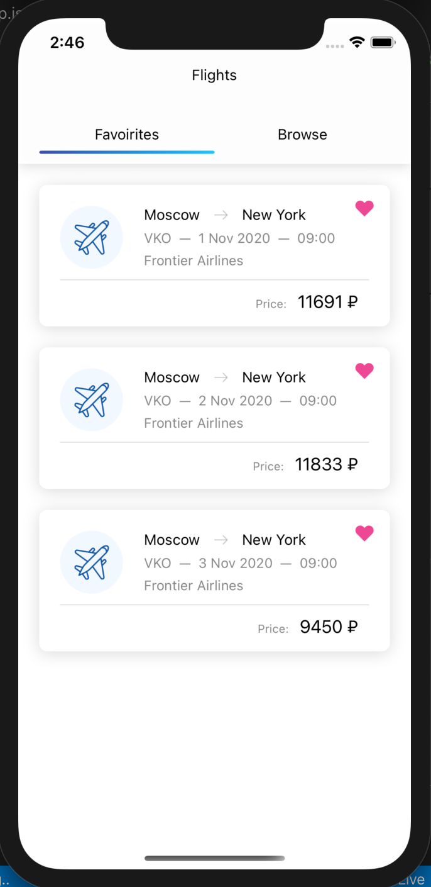

# skyscanner-flight-search

Тестовое задание.
Поиск билетов с текущей даты + 10 дней.
Города, аэропорты вылета/прилета захардкорены.

Используемые технологии:
  - React Native
  - Redux
  - Redux-Saga
  - SkyScanner API

Инициализация приложения через expo init.

  

    

  

