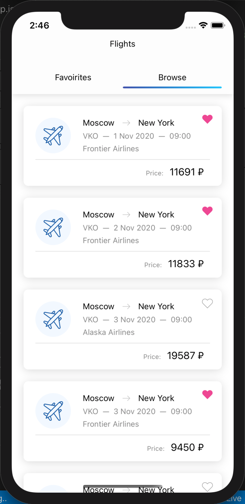
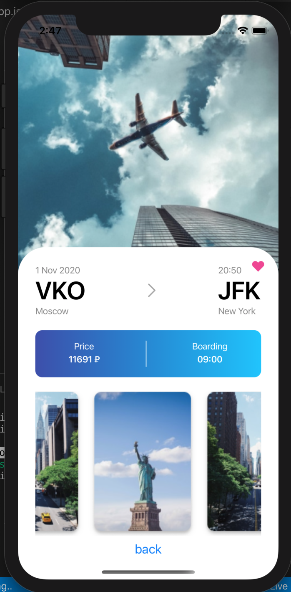

# skyscanner-flight-search

Тестовое задание.
Поиск билетов с текущей даты + 10 дней.
Города, аэропорты вылета/прилета захардкорены.

Используемые технологии:
  - React Naative
  - Redux
  - Redux-Saga
  - SkyScanner API

Инициализация приложения через expo-create-app
Запуск: 
  npm i
  npm start
  
  
  
  
